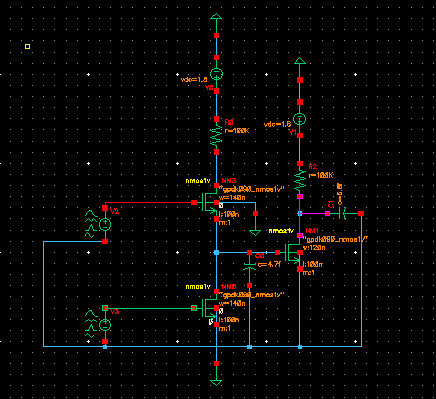

# NMOS Driver Resistive-Load OR Gate  

Designed and simulated a **two-input OR gate** using a **resistive-load NMOS architecture** in **Cadence Virtuoso** and **Microwind**.

## Project Overview
This project demonstrates the working of an OR logic gate implemented using NMOS transistors with a resistive load.  
The design was verified through schematic, layout, and transient simulations to evaluate propagation delay and logic behavior.

### Key Features
- Implemented using **resistive-load NMOS configuration**
- Simulated at **90 nm technology node**
- Achieved propagation delay ≈ **2 ns**
- Tools used: **Cadence Virtuoso**, **Microwind**

## Circuit Details
- Two NMOS transistors act as pull-down devices (series driver configuration)
- A resistive load provides pull-up to VDD
- Output verified using transient and DC transfer simulations

## Results
| Parameter | Value |
|------------|--------|
| Supply Voltage (VDD) | 1.2 V |
| Technology Node | 90 nm |
| Propagation Delay | ≈ 2 ns |
| Load Resistance | Tuned for target delay |

---

### Layout and Schematic

**Layout built in Microwind**  

**Schematic prepared in Cadence Virtuoso**  

**Working waveforms

Delay is'nt 2ns yet, but Working on it 
---

### Future Work
- Optimize R and C values to minimize delay and power  
- Extend design to NOR and NAND configurations for comparative analysis  

---

**Author:** *Ishaan Bhimajiyani*  
[GitHub Profile](https://github.com/Ishaan2005)
